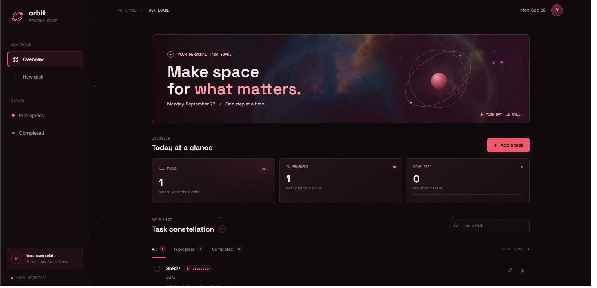
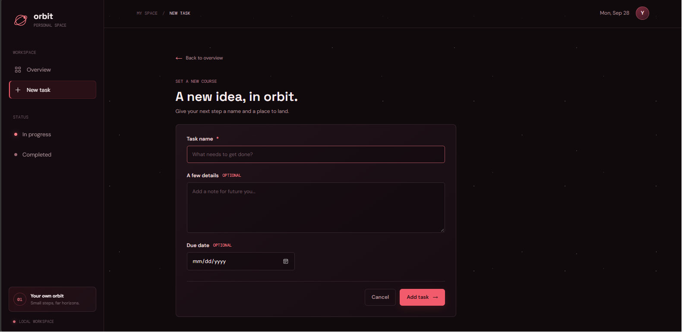
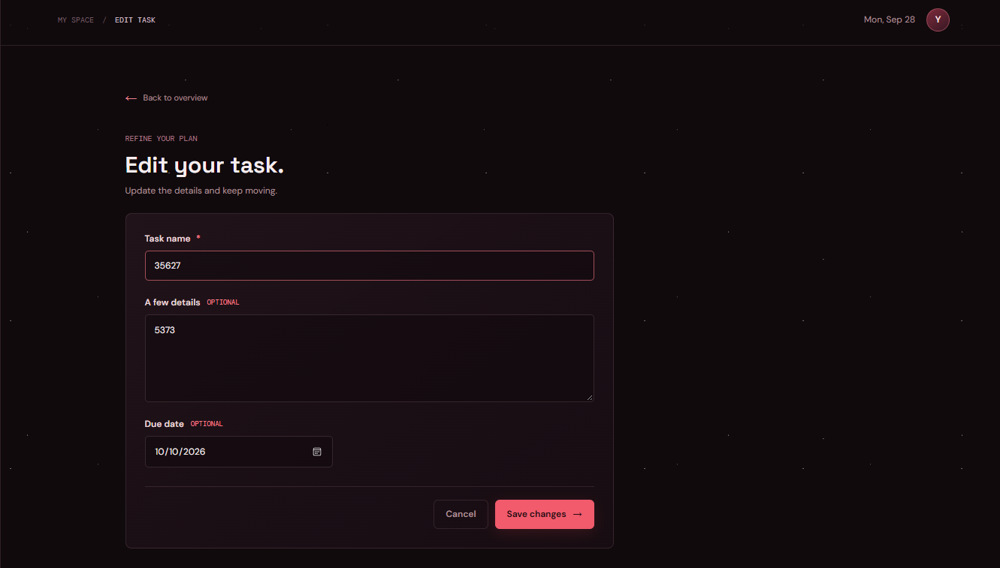
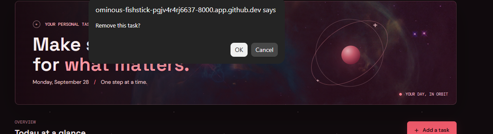

# cogtas_taskmanager

| Project Detail | Value |
| --- | --- |
| Project Code | WST21-PM-2026-SF |
| Student Name | Christian Cogtas |
| Course & Year | BSIT-2 |
| Database Used | SQLite |

## Features

- Add Task
- View Tasks
- Edit Task
- Delete Task
- Update Status (Pending or Completed)

## Screenshots and Walkthrough

### 1. View the task dashboard

The dashboard summarizes all tasks, tasks in progress, and completed tasks. From here, you can browse or filter the list, search for a task, and mark a task complete or reopen it. Select **Add a task** to create a new task.

### 2. Add a task

Enter a task name, which is required. You can also add details and a due date. Select **Add task** to save it and return to the dashboard.

### 3. Edit a task

On the dashboard, select the edit icon beside a task. Update its name, details, or due date, then select **Save changes**. Use **Cancel** or **Back to overview** to return without saving.

### 4. Delete a task

Select the delete icon beside the task you want to remove. When the confirmation prompt appears, confirm the removal to delete the task; cancel it to keep the task.
